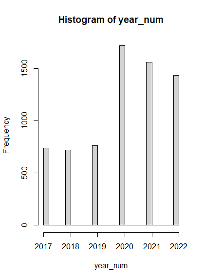
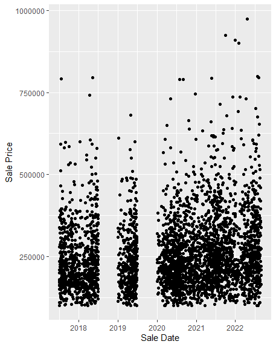

<!-- README.md is generated from README.Rmd. Please edit the README.Rmd file -->

```{r setup, include=FALSE}
knitr::opts_chunk$set(echo = TRUE)
```

# Lab report #1

TL;DR

We all gave pretty similar answers as far as the question 1, variables,
but we have a couple of different paths after that, which we explored.

Follow the instructions posted at
<https://ds202-at-isu.github.io/labs.html> for the lab assignment. The
work is meant to be finished during the lab time, but you have time
until Monday evening to polish things.

Include your answers in this document (Rmd file). Make sure that it
knits properly (into the md file). Upload both the Rmd and the md file
to your repository.

All submissions to the github repo will be automatically uploaded for
grading once the due date is passed. Submit a link to your repository on
Canvas (only one submission per team) to signal to the instructors that
you are done with your submission.

Grant `Question 1:` There are many variables including: Address,
Occupancy, Price, YearBuilt, and Bedrooms. There are number, character,
date type of variables in the dataset. The address gives the address of
the house, the occupancy gives the number of people that can live in the
house, the price lists the last price the home sold at, the YearBuilt
gives the year that house was built, and bedrooms lists the number of
bedrooms in the house. We would expect the range of the Sale Price data
to be between 50,000 to 1,500,000

Hudson `Question 1:` The variables included, which can be viewed using
my personal favorite data exploration function, `head()` are as follows:
char string `Parcel ID` expected to be a unique 10 number ID, char
string `Address` indicator of geographic location, Factor `Style` with
12 possibilities, Factor `Occupancy` with 5 possibilities, Date
`Sale Date` date sold, num `Sale Price` price the house sold for on
`Sale Date`, char string`Multi Sale` whether the property was a
"multi-home" (An apartment building vs a single condo), num `YearBuilt`
year built, num `Acres` number of acres for the land, num
`TotalLivingArea (sf)` square feet in the home, num `Bedrooms` integer
number of bedrooms, num `FinishedBsmtArea (sf)` square feet of finished
basement, num `LotArea(sf)` number of square feet for the lot, char
string `AC` yes or no for if it has air conditioning, char string
`FirePlace` yes or no for if it has a fireplace, and Factor
`Neighborhood` with 42 options for which neighborhood, which is either
"none" or 1 of 41 neighborhoods in Ames.

Grant `Question 2:` The Price and Year Built variable have a special
focus for this project since we are looking at the historic residential
sales of houses in Ames since 2017.

Hudson `Question 2:` The `Sale Price` and `Sale Date` (limited by
`Bedrooms` because behavior could be different between 1 bedroom, and 4
bedroom homes) could have extra significance to learn more about how
`Sale Price` has been effected by time.

Grant `Question 3:` The range of the sale price variable is between 0
and 20,500,000. Most of the data seems to fall between 100,000 and
1,000,000. There are many outliers under 100,000 and over 20,000,000
which seems like they are impossible to sell for that price in Ames.


Hudson `Question 3:` This Histogram displays the differing number of homes purchase each year of our data. 



Grant `Question 4` We think that the variable Year Built could be
related to the sale price since newer houses tend to be more expensive.
Using the scatterplot we can see a pattern of more houses being higher
priced the when their Year Built is closer to the current date. However
there were some oddities like NA values and false data in the dataset
that we had to clean before plotting it. 

Hudson `Question 4:` This scatterplot displays all the different homes within our filter, and shows us: while the density of points appears roughly the same withing the 100,000 to 600,000 dollar sales range throughout the years, we see more dots shift above the 600,000 dollar mark.  


