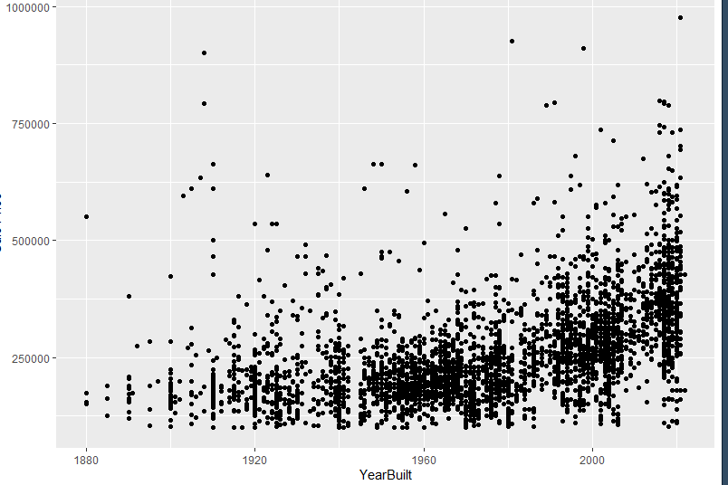

<!-- README.md is generated from README.Rmd. Please edit the README.Rmd file -->


```{r setup, include=FALSE}
knitr::opts_chunk$set(echo = TRUE)
```

# Lab report #1

Follow the instructions posted at https://ds202-at-isu.github.io/labs.html for the lab assignment. The work is meant to be finished during the lab time, but you have time until Monday evening to polish things.

Include your answers in this document (Rmd file). Make sure that it knits properly (into the md file). Upload both the Rmd and the md file to your repository.  

All submissions to the github repo will be automatically uploaded for grading once the due date is passed.
Submit a link to your repository on Canvas (only one submission per team) to signal to the instructors that you are done with your submission.

Grant
`Question 1: ` There are many variables including: Address, Occupancy, Price, YearBuilt, and Bedrooms. There are number, character, date type of variables in the dataset. The address gives the address of the house, the occupancy gives the number of people that can live in the house, the price lists the last price the home sold at, the YearBuilt gives the year that house was built, and bedrooms lists the number of bedrooms in the house. We would expect the range of the Sale Price data to be between 50,000 to 1,500,000


Grant
`Question 2: ` The Price and Year Built variable have a special focus for this project since we are looking at the historic residential sales of houses in Ames since 2017.


Grant
`Question 3: ` The range of the sale price variable is between 0 and 20,500,000. Most of the data seems to fall between 100,000 and 1,000,000. There are many outliers under 100,000 and over 20,000,000 which seems like they are impossible to sell for that price in Ames. 


Grant 
`Question 4` We think that the variable Year Built could be related to the sale price since newer houses tend to be more expensive. Using the scatterplot we can see a pattern of more houses being higher priced the when their Year Built is closer to the current date. However there were some oddities like NA values and false data in the dataset that we had to clean before plotting it. 


